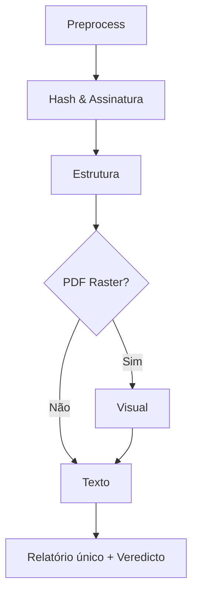

# Fraude Documental

 

> **Verifique, explique e durma tranquilo** – um pipeline modular em Python que
> valida **integração criptográfica**, estrutura interna, conteúdo visual e
> textual de documentos PDF/DOCX.

---

## Visão Geral

A fraude documental evoluiu; nossa resposta também. Este projeto consolida **4
camadas forenses** em código aberto:

| Camada | Módulo                        | O que faz                                                 | Tecnologias                                            |
| ------ | ----------------------------- | --------------------------------------------------------- | ------------------------------------------------------ |
| 0      | `document_preprocessor.py`    | Hash + metadados + render                                 | `pikepdf`, `pdfplumber`, `pdf2image`                   |
| 1      | `verifica_hash_assinatura.py` | Verifica PAdES/LTV (ICP‑Brasil, eIDAS) e XMLDSig          | `pyHanko`, `cryptography`                              |
| 2      | `analise_estrutura.py`        | Detecta incremental updates suspeitos, macros, JavaScript | `pikepdf`, `lxml`                                      |
| 3      | `analise_visual.py`           | Copy‑move, PRNU\* (opcional), OCR                         | `opencv‑python‑headless`, `prnu-python`, `pytesseract` |
| 4      | `analise_texto.py`            | Termos suspeitos, multi‑idioma, estilometria              | `langdetect`, `nltk`, `textstat`                       |
| ✔      | `verificador_documental.py`   | Orquestra tudo e gera relatório JSON                      | —                                                      |

\*PRNU: fingerprint de sensor para identificar páginas escaneadas de scanners
ou câmeras diferentes.

---

## Arquitetura



Cada camada roda **independente**, grava seu JSON e repassa artefatos (texto
OCR, metadados, etc.) para a próxima – favorecendo paralelização futura.

---

## Instalação Rápida

```bash
# 1. clone
$ git clone https://github.com/wagbr/fraude-documentos.git
$ cd fraude-documentos

# 2. virtualenv
$ python -m venv .venv && source .venv/bin/activate

# 3. dependências
$ pip install -r requirements.txt

# 4. instale poppler & tesseract (Windows)
#    choco install poppler tesseract
```

> **Poppler** é obrigatório para renderizar PDFs rasterizados.

---

## Uso

```bash
# pipeline completo (JSON consolidado)
python verificador_documental.py CONTRATO.pdf --verbose -o contrato_full.json

# módulos isolados
python analise_visual.py contrato_scan.pdf -v -o visual.json
python analise_estrutura.py contrato.pdf -v -o estrutura.json
```

Saída típica:

```json
{
  "verdict": "OK",
  "assinatura_hash": { "signatures": [{ "status": "VALID" }] },
  ...
}
```

---

## 🔒 Heurística de “Suspeito”

```python
sig_ok   = status in {"VALID", "UNVERIFIED_HYBRID"}
structok = not (incr_updates and javascript)
visualok = not copy_move
texto_ok = not suspicious_terms

verdict = "SUSPEITO" if not all([sig_ok, structok, visualok, texto_ok]) else "OK"
```

A lógica está em `verificador_documental.py` – ajuste à sua política.

---

## 📚 Referências Acadêmicas

* **Colette et al. (2025)** – *TransCMFD: Transformer‑based Copy‑Move Forgery Detection* (CVPR’25)
* **Gurumurthy & Fried (2024)** – *DiffForensics: Leveraging Diffusion Models for Image Tamper Localization* (CVPR’24)
* **NIST SAT‑ML Part II** (2024) – Dataset governamental de manipulação multi‑câmera
* **Riva et al. (2023)** – *PRNU Analysis for Multi‑Page PDF Authentication* (Forensic Sci. Int.)
* **ICP‑Brasil DOC‑ICP‑15 v5** (2023) – Política de Assinatura PAdES

> Lista ampliada no arquivo `docs/REFERENCES.md`.

---

> *“Dados confiáveis geram decisões confiáveis.”* – todo(a) auditor feliz
